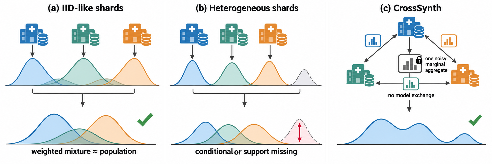

# CrossSynth

Reference implementation for **CrossSynth**, a federated tabular diffusion method guided by a differentially private aggregate of cross-party marginal counts. This repository contains **source code only**: training and evaluation scripts, marginal aggregation, protocol simulation, and synthetic-data generators. It does **not** ship datasets or precomputed experiment outputs.



## Requirements

- Python 3.10+
- See `requirements.txt` (PyTorch, Opacus, NumPy, pandas, scikit-learn, CatBoost, SciPy, tqdm, tabulate).

Install:

```bash
pip install -r requirements.txt
```

## Quick test

A bare run uses the manuscript profile. The historical probability-space path is an explicit switch:

```bash
python run_experiments.py --quick
python run_experiments.py --quick --profile legacy
```

## Full experiments

The Python API keeps the historical defaults for backwards compatibility. A bare `python run_experiments.py` instead selects the explicit `paper` profile. That path releases one concatenated count workload with replace-one sensitivity `sqrt(2 * |Q|)`, assigns one tenth of epsilon and of delta to the release, rounds the noisy counts, reconstructs their sum with in-process additive shares, and trains with Opacus. Generation draws a two-times candidate pool and applies one damped (`0.1`) one-way marginal calibration pass. The pairwise workload is not used by this output-calibration step. `--profile legacy` retains normalized-histogram noise and no calibration.

```bash
python run_experiments.py
python run_experiments.py --profile legacy
```

Filter examples:

```bash
python run_experiments.py --dataset adult --method fedsynth
python run_experiments.py --profile paper --partition correlated --seeds 3 --epochs 100
python run_experiments.py --profile paper --method fedavg_8bit --partition correlated
python run_experiments.py --profile paper --dataset adult --partition support_mismatch --K 3
python run_revision_ablations.py --profile smoke
python run_revision_ablations.py --profile paper --seeds 3 --epochs 100
```

## Package layout

| File | Role |
|------|------|
| `run_experiments.py` | CLI entry point; grid search, protocol profiles, and metrics aggregation |
| `run_revision_ablations.py` | Measured conditioning, marginal-set, and budget-split sweeps |
| `synthesizer.py` | CrossSynth, dense/8-bit FedAvg, independent/centralized diffusion, PrivBayes |
| `marginals.py` | Count queries, Gaussian release, modular additive-share simulator, conditioning encoder |
| `datasets.py` | OpenML loaders and random, correlated, or hard support-mismatch partitions |
| `metrics.py` | ML utility, marginal TVD, association error, and conditional F1 |
| `benchmark_config.py` | Shared hyperparameters and grid definitions |
| `tests/test_protocol.py` | Count-sensitivity and secure-sum regression tests |

## Fit controls

`CrossSynthGenerator.fit` preserves the legacy probability-space defaults so existing callers do not silently change protocols. The CLI `paper` profile explicitly enables count-space release, integer rounding, additive-share reconstruction, private training, and regularized one-way output calibration. Private training spends the complementary epsilon budget through Opacus at sample rate `B/n_k`. The legacy and paper profiles are different protocols and their outputs must not be combined in one result table.

`cond_mode` selects a real marginal target or a same-shape constant, random, or absent control. Under the paper profile, that target governs both the fixed-size network input and the explicit post-generation calibration, making the control measurable rather than relying only on a broadcast vector. `M=50` and `selection=domain_size` choose the optional two-way workload; `selection=random` remains available. The support-mismatch protocol uses the Adult age bands below 30, 30--49, and 50 or older, and reports downstream F1 averaged across those test groups.

Datasets are **downloaded automatically** through `sklearn.datasets.fetch_openml` where applicable; no proprietary files are included.

## Citation

If you use this code, please cite the CrossSynth paper and this repository.

## License

Code is provided for research purposes. See the repository license file if present.
